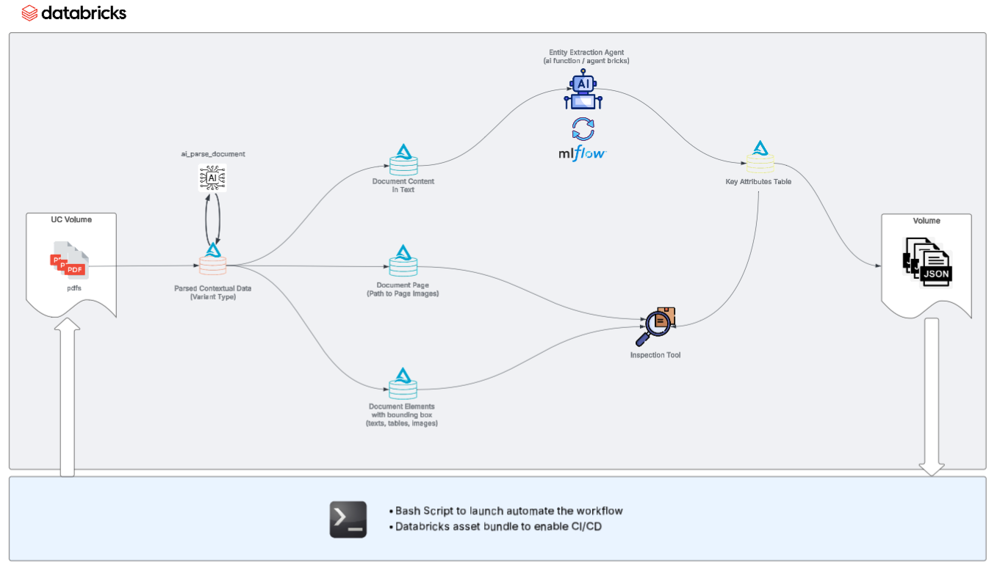
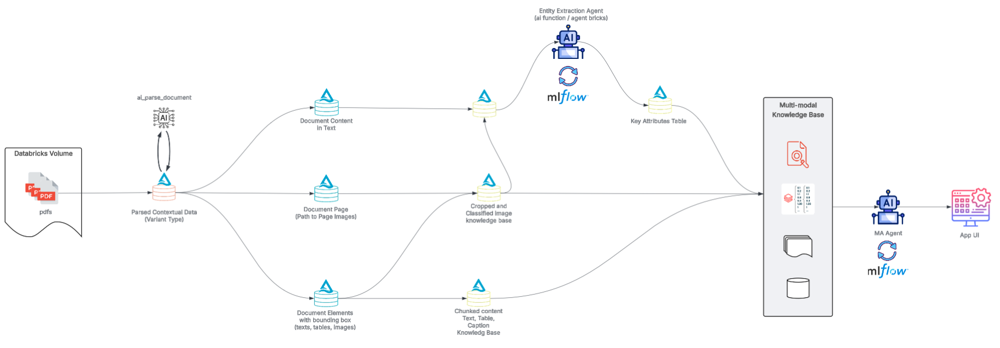

# Databricks Asset Bundle Examples for GenAI Workflows

Production-ready examples demonstrating incremental document processing workflows using Databricks Asset Bundles, Structured Streaming, and AI functions.

## Workflows

### 1. [Unstructured Information Extraction Workflow](./unstructured_ie_workflow)

A streamlined 4-stage pipeline for extracting structured data from documents:
- **Parse** PDFs/images with `ai_parse_document`
- **Extract** clean text content
- **Analyze** content with `ai_query` or agent bricks endpoints
- **Export** structured entities as JSONL

**Best for**: Information extraction, document classification, entity recognition, financial data extraction

**Key features**: JSONL export, CLI workflow runner with file management, serverless compute, optional cleanup stage



### 2. [Parse-Translate-Classify Workflow](./unstructured_data_process_workflow)

A multi-lingual document processing pipeline for segmenting and classifying content:
- **Parse** documents (PDF, PPTX, DOCX) with `ai_parse_document`
- **Translate** content to English while preserving formatting
- **Segment** and classify documents (CVs, credentials, resumes)
- **Transform** into individual structured records

**Best for**: Multi-lingual document processing, CV/resume extraction, credential verification, document segmentation

**Key features**: Config-based LLM management (YAML), streaming pipeline with checkpointing, multi-format support, automatic volume creation

### 3. [Unstructured Knowledge Base Workflow](./unstructured_data_knowledge_base_workflow)
A comprehensive 9-stage pipeline for creating searchable knowledge bases:
- **Parse** documents with bounding boxes and metadata
- **Extract** text, elements, and page information
- **Crop** diagrams and charts for specialized analysis
- **Chunk** content for embeddings
- **Enrich** text with visual diagram information
- **Analyze** with LLMs for structured extraction

**Best for**: RAG applications, knowledge bases, multi-modal document understanding, technical documentation processing

**Key features**: Diagram extraction, content chunking, visual enrichment, foreachBatch processing



## Architecture

All workflows use:
- **Databricks Asset Bundles** for CI/CD and infrastructure-as-code
- **Structured Streaming** with checkpointing for incremental processing
- **Unity Catalog** for data governance
- **Serverless Compute** for cost efficiency
- **Task Dependencies** for orchestration

## Quick Start

```bash
# Authenticate
databricks auth login --host https://your-workspace.cloud.databricks.com

# Choose a workflow
cd unstructured_ie_workflow                      # Information extraction
# cd unstructured_data_process_workflow          # Parse-translate-classify
# cd unstructured_data_knowledge_base_workflow   # Knowledge base

# Deploy and run (examples)
./run_workflow.sh --profile YOUR_PROFILE                        # Basic usage
./run_workflow.sh --upload-pdfs --download-jsonl               # With file management (IE workflow)
./run_workflow.sh --var clean_pipeline_tables=Yes              # Override variables
./run_workflow.sh --var agent_choice=agent_bricks              # Custom configuration
```

See individual workflow READMEs for detailed configuration and usage.

## Resources

- [Databricks Asset Bundles](https://docs.databricks.com/dev-tools/bundles/)
- [Databricks Workflows](https://docs.databricks.com/workflows/)
- [Structured Streaming](https://docs.databricks.com/structured-streaming/)
- [`ai_parse_document` Function](https://docs.databricks.com/aws/en/sql/language-manual/functions/ai_parse_document)
- [`ai_query` Function](https://docs.databricks.com/aws/en/sql/language-manual/functions/ai_query)
